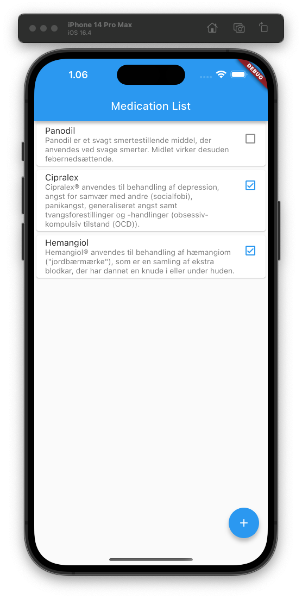

# Model-View-ViewModel Example

This in an example of how to design your app to follow the [Model–View–ViewModel](https://en.wikipedia.org/wiki/Model%E2%80%93view%E2%80%93viewmodel) software architecture. This entails that you divide ("separate") your app into three main types of components:

In our case, the Model contains the domain knowledge of the device(s), and the View contains all the Flutter widgets, and the ViewModel contains and enriches data from the Model to be shown in the View.

## User Interface

This simple example app shows a list of medication using a ListView widget, as shown below. When the user presses the "+" button, an additional medication (the "Hemangiol") is added to the list.

 

## Software Architecture

 As said, the app follows the Model-View-ViewModel (MVVM) architecture. In a Flutter app, a MVVM architecture is typically implemented by having "model", "view", and "view_model" folders in your app structure, like this:

